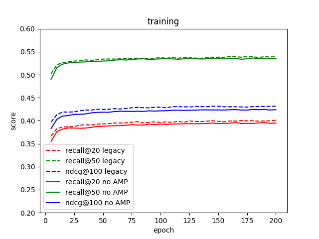

# Variational Autoencoder for Collaborative Filtering for TensorFlow

## Table Of Contents
* [The Model](#the-model)
  * [Default Configuration](#default-configuration)
  * [Data Preprocessing](#data-preprocessing)
* [Setup](#setup)
  * [Requirements](#requirements)
* [Quick start guide](#Quick-start-guide)
* [Datasets](#Datasets)
* [Results](#Results)
* [Changelog](#Changelog)
* [Known issues](#known-issues)


# The model
The Variational Autoencoder model is a neural network that provides collaborative filtering based on implicit feedback, specifically, 
it provides product recommendations based on user and item interactions. The training data for this model should contain a sequence of user ID, 
item ID pairs indicating that the specified user has interacted with, for example, was given a rating to or clicked on, 
the specified item. This model is optimized implementation of Variational Autoencoder proposed in [Variational Autoencoders for Collaborative Filtering](https://arxiv.org/abs/1802.05814) paper. 

<p align="center">
   
   <br>
   Figure 1. The architecture of an Autoencoder.</p>

The following features were implemented in this model:

* Data-parallel multi-GPU training with [Horovod](https://github.com/horovod/horovod)
* Mixed precision support with [TensorFlow Automatic Mixed Precision](https://docs.nvidia.com/deeplearning/sdk/mixed-precision-training/index.html#tensorflow-amp) (TF-AMP), which enables mixed precision training without any changes to the code-base by performing automatic graph rewrites and loss scaling controlled by an environmental variable. To enable the full potential of this feature, your GPU should have Tensor Cores (e.g. NVIDIA Volta series GPU).

The following performance optimizations were implemented in this model:

* Feeding sparse matrix instead of dense to the model
* Loading data using [new TF datasets](https://medium.com/tensorflow/introducing-tensorflow-datasets-c7f01f7e19f3)


## Default Configuration
This model trains for 200 epochs, with default setup:

* Learning rate = 0.001
* Batch size containing 10000 Users
* Annealing with 200000 anneal steps and anneal cap = 0.2
* Regularisation loss factor = 0.01
* Dimensions of consecutive encoder layers = `[ITEMS_COUNT, 600, 200]`
* Dimensions of consecutive decoder layers = `[200, 600, ITEMS_COUNT]`

## Data Preprocessing
This model uses the following data preprocessing:

* Removing users who had less than 5 interactions with items
* Randomally shuffle users, to make more diverse batches
* Split users and items into train, test and validation
* Split items inside test and validation into 80% of items 
to feed into model and check if it predicts the rest.

# Setup

The following section list the requirements that you need to meet in order to use the VAE model.

## Requirements
This repository contains Dockerfile which extends the Tensorflow NGC container and encapsulates all dependencies.  Aside from these dependencies, ensure you have the following software and hardware:

* [NVIDIA Docker](https://github.com/NVIDIA/nvidia-docker)
* [TensorFlow 19.05-py3 NGC container](https://ngc.nvidia.com/catalog/containers/nvidia:tensorflow)
* [GPU featuring Tensor Cores](https://www.nvidia.com/en-us/data-center/tensorcore/)

For more information about how to get started with NGC containers, see the
following sections from the NVIDIA GPU Cloud Documentation and the Deep Learning Documentation:  

* [Getting Started Using NVIDIA GPU Cloud](https://docs.nvidia.com/ngc/ngc-getting-started-guide/index.html),  
* [Accessing And Pulling From The NGC container registry](https://docs.nvidia.com/deeplearning/dgx/user-guide/index.html#accessing_registry)  
* [Running Tensorflow](https://docs.nvidia.com/deeplearning/dgx/tensorflow-release-notes/running.html#running).

# Quick start guide
To train your model using mixed precision with tensor cores, perform the following steps using the default parameters of 
the VAE model on the [MovieLens 20M](https://grouplens.org/datasets/movielens/) dataset. 
The dataset is automatically downloaded and prepared if needed.

### 1. Clone this repository

```bash
git clone https://github.com/mkfilipiuk/recommendation-system-nvidia-zpp
cd recommendation-system-nvidia-zpp

```

### 2. Build the VAE TensorFlow NGC container

After Docker is correctly set up, you can build the VAE image with:

```bash
nvidia-docker build . -t nvidia_vae_running
``` 

### 3. Launch the VAE TensorFlow Docker container
```bash
./scripts/docker/interactive.sh
``` 

### 4. Install missing packages in Docker container
```bash
./scripts/docker/install.sh
``` 

### 5. Start training
```bash
python3 main.py --train --use_tf_amp
```
### 6. Test model

The model is exported to export_dir and then can be loaded and tested using


```bash
python3 main.py --test
```

## Details

The following sections provide greater details of the dataset, running training and inference, and the training results.

### Command Line Arguments

To see the full list of available options and their descriptions, use the `--help` command line option, for
example: 

```bash
python main.py --help
```

Aside from options to set hyperparameters, the relevant options to control the behaviour of the script are: 

| Command | Description |
| --- | --- |
| `--train` | Train the model. The training is run at the beginning and might be omitted by loading pretrained model from export_dir. |
| `--test` | Test the model. The tests are run after the training, and print metric results. If the train option is not specifed then the model is imported from directory export_dir. |
| `--benchmark` | Benchmark the training. It prints average epoch training time and average epoch validation time. |
| `--use_tf_amp` | Turn on Automatic Mixed Precision. |
| `--dataset` | Choose the dataset that the model is going to learn from. See [below](#Datasets) for details |
| `--gpu_number` | In case of multiple GPUs available, you can specify its number. |
| `--number_of_gpus` | Number of GPUs used during multi-GPU training. If equals zero, VAE will use CPU. |
| `--number_of_epochs` | Number of epochs for training. The default value is 200 epochs and it's enough to reach the maximum accuracy (with default batch size). |
| `--batch_size_train` | Batch size of training. The default value is 10000. It represents the number of users that is fed into the network at each step. |
| `--batch_size_validation` | Batch size for validation and test. The default value is 10000.  |
| `--validation_step` | If it's set to `n` then validation is run once every `n` epochs. |
| `--warm_up_epochs` | Number of epochs to omit during benchmark. First epochs perform worse in comparing to next epochs due to framework initialisation. It is used only during benchmark. |
| `--total_anneal_steps` | Number of annealing steps. |
| `--anneal_cap` | Annealing cap |
| `--lam` | Lambda – L2 regularization parameter. |
| `--lr` | Learning rate. |

# Datasets

Script supports following datasets:

| Name | Description | # of users | # of items |
| ---  |  ---         | ---:| ---: |
| `ml-20m` | Explicit user ratings of movies from movielens.org | 138493 | 26744 | 
| `ml-20m_alt`  | As above, but with alternative method of processing | 138493 | 26744 | 
| `netflix` | Explicit user rating of movies from Netfix. It was used during Netfix prize contest | 480189 | 17770 |
| `lastfm` | Artists played by the user | 358868 | 295041 |
| `pinterest` | Images pinned to boards. We treat boards as users and pins as items. | 46000 | 2565241 |

# Results

The following sections provide details on how we achieved our results in training accuracy, performance and inference performance.

## Training accuracy results

Our results were obtained by running the commands listed below in the tensorflow-19.05-py3 Docker container on NVIDIA DGX Station with 4 V100 32GB GPUs.

```
# Single GPU
python3 main.py --train --number_of_epochs 200 --batch_size_train 14504 --dataset ml-20m --use_tf_amp
python3 main.py --train --number_of_epochs 200 --batch_size_train 14504 --dataset ml-20m

# Multi GPU
python3 main.py --train --number_of_epochs 200 --batch_size_train 14504 --dataset ml-20m --number_of_gpus {2,4} --lr 0.007 --total_anneal_steps 1000 --lam 0.001 --use_tf_amp
python3 main.py --train --number_of_epochs 200 --batch_size_train 14504 --dataset ml-20m --number_of_gpus {2,4} --lr 0.007 --total_anneal_steps 1000 --lam 0.001
```


| **Number of GPUs** | **AMP NDCG@100** | **AMP Recall@20** | **AMP Recall@50** | **FP32 NDCG@100** | **FP32 Recall@20** | **FP32 Recall@50** |
|:------------------:|:----------------------------:|:---------------------------------:|:-------------:|:----------------------:|:---:|:---:|
| 1 | TODO | TODO | TODO | TODO | TODO | TODO |
| 2 | TODO | TODO | TODO | TODO | TODO | TODO |
| 4 | TODO | TODO | TODO | TODO | TODO | TODO |


## Training performance results


Our results were obtained by running the commands listed below in the tensorflow-19.05-py3 Docker container on NVIDIA DGX Station with 4 V100 32GB GPUs.
```
# Single GPU
python3 main.py --train --number_of_epochs 200 --batch_size_train 14504 --dataset ml-20m --use_tf_amp
python3 main.py --train --number_of_epochs 200 --batch_size_train 14504 --dataset ml-20m

# Multi GPU
python3 main.py --train --number_of_epochs 200 --batch_size_train 14504 --dataset ml-20m --number_of_gpus {2,4} --lr 0.007 --total_anneal_steps 1000 --lam 0.001 --use_tf_amp
python3 main.py --train --number_of_epochs 200 --batch_size_train 14504 --dataset ml-20m --number_of_gpus {2,4} --lr 0.007 --total_anneal_steps 1000 --lam 0.001
```

| **Number of GPUs** | **AMP training time** | **FP32 training time** | **AMP Speedup** |
|:------------------:|:-------------:|:----------------------:|:---:|
| 1 | TODO | TODO | TODO |
| 2 | TODO | TODO | TODO |
| 4 | TODO | TODO | TODO |


# Changelog
1. July 18, 2019
  * Initial release

# Known issues
1. Underperforming on ML-20M dataset
Currently, our model slightly underperforms in comparison with the [original implementation](https://github.com/dawenl/vae_cf). It is clearly visible on the plot beneath:

<p align="center">
   
   <br>
   Figure 2. Metrics comparision between original model(legacy) and our implementation without mixed precision(no AMP) </p>

We are currently working on finding the cause of this issue.













